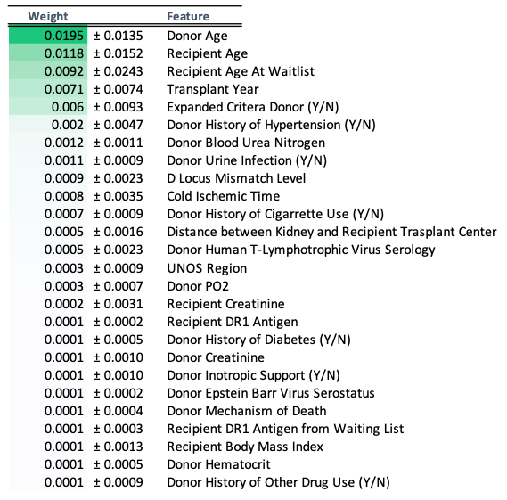

# Eliminating the Use of Race in Kidney Graft Failure Risk Prediction

 ## Contents:
- [Background](#Background)
    - [Limitations of the Original Model](#Limitations-of-the-Original-Model)
- [Problem Statement](#Problem-Statement)  
- [Data](#Data)
- [Executive Summary](#Executive-Summary)
    - [Methods](#Methods)
    - [Models](#Models)
      - [Random Survival Forests](#Random-Survival-Forests)
      - [DeepSurv](#DeepSurv)
    - [Model Training](#Model-Training)
    - [Feature Importance](#Feature-Importance)
    - [Model Performance](#Model-Performance)
- [Conclusions and Future Directions](#Conclusions-and-Future-Directions)

## Background
The Kidney Donor Risk Index is a prognostic algorithm developed by Rao et al. (2009) and used by physicians to aid in making decisions regarding kidney allocation for transplants.[1](https://journals.lww.com/transplantjournal/Fulltext/2009/07270/A_Comprehensive_Risk_Quantification_Score_for.13.aspx) The original paper utilized Cox Regression to model the risk of graft failure or death using 69,440 transplant records from first-time, kidney-only, deceased donor adult transplants occurring between 1995-2005.[1](https://journals.lww.com/transplantjournal/Fulltext/2009/07270/A_Comprehensive_Risk_Quantification_Score_for.13.aspx) The KDRIfull includes 13 donor, recipient, and transplant factors found to predict the risk of graft failure or death based on this model.
The KDRIdonor-only was adapted from the KDRIfull, and includes the 10 following donor-only characteristics known prior to transplant: Age, Weight, Height, Ethnicity/Race, History of Hypertension, History of Diabetes, Cause of Death, Serum Creatinine, Hepatitis C Virus Serology, and Donation after Circulatory Death (DCD) criteria[2](https://journals.lww.com/transplantjournal/Fulltext/2018/01000/Validation_of_the_Prognostic_Kidney_Donor_Risk.29.aspx) The KDRIdonor-only is used by clinicians to make decisions regarding kidney allocation for transplant because of its simplified number of inputs and similar accuracy compared to the KDRIfull.

### Limitations of the Original Model
Though the KDRI has been praised for its granularity compared to the previous Extended Criteria Donor versus Standard Criteria Donor dichotomy, the model and methodology of the original study have substantial limitations.[3](https://academic.oup.com/ndt/article/30/8/1285/2324817?login=true)

##### 1. Use of Race/Ethnicity
The use of race and ethnicity in clinical decision-making algorithms has recently come under scrutiny within the medical community.[4](https://www.nejm.org/doi/full/10.1056/NEJMms2004740) Use of race ignores historical racial inequity in access to and quality of healthcare which likely contributes to the underlying disparities in graft survival outcomes.
Worse still, use of race in the KDRI may exacerbate existing inequity by shrinking the kidney donor pool for black patients, who already experience longer wait times for kidney transplants than non-black patients.[4](https://www.nejm.org/doi/full/10.1056/NEJMms2004740)

##### 2. Predictive Outcome
Though the KDRI is widely understood to predict the risk of graft failure for a particular donor kidney, the original study defined graft failure as return to dialysis, retransplant, or death, without regard to cause of death.[1](https://journals.lww.com/transplantjournal/Fulltext/2009/07270/A_Comprehensive_Risk_Quantification_Score_for.13.aspx) This approach reduces the baseline predictive value of the KDRI, and calls the association between the identified transplant characteristics and graft failure into question, since these characteristics may instead predict death unrelated to graft failure.

##### 3. Advancements in Transplant Medicine
The original study included transplant data from 1995-2005, but advancements in transplant medicine in the past fifteen years have substantially improved graft survival.[5](https://journals.lww.com/transplantjournal/fulltext/2010/12270/Induction_Immunosuppression_Improves_Long_Term.43.aspx) [6](https://www.ncbi.nlm.nih.gov/pmc/articles/PMC5464785/) In light of these advancements, the KDRI should be reformulated using more recent patient data.

## Problem Statement

The aim of this project is to create a new Kidney Graft Failure Prediction tool by:
 - Eliminating the race-adjustment for Black kidney donors
 - Redefining graft failure using death censorship
 - Using a combination of machine learning techniques to isolate important predictive variables and improve predictive accuracy

## Data: Standard Transplant Analysis and Research Files (STAR)
As per the Organ Transplantation and Procurement Network (OPTN), "STAR files are limited datasets that contain patient-level information about transplant recipients, deceased and living donors, and waiting list candidates back to 10/1/1987." This dataset includes waiting list, transplant, donor, and follow-up records for heart, lung, liver, intestine, pancreas and kidney transplants, including multi-organ transplants.   

In accordance with the OPTN Data Use Agreement, the de-identified patient-level data contained in the STAR database and used in the subsequent analysis and modeling are not available in this repository. You may request the data [here](https://optn.transplant.hrsa.gov/data/request-data/data-request-instructions/).

## Executive Summary

#### Methods
Using SQLite, most recent transplant follow-up records were isolated from the Kidney Followup data table for each transplant record ID. The Kidpan data table was filtered sequentially using the same exclusion criteria used in the original model.[1](https://journals.lww.com/transplantjournal/Fulltext/2009/07270/A_Comprehensive_Risk_Quantification_Score_for.13.aspx) Kidpan data, Deceased Donor, and Kidney Followup data tables were combined on Transplant ID from the Kidpan data table, and the combined table was filtered for transplant dates occurring in or after 2005. Duplicate transplant records were removed using Python after exporting the dataframe.

Data cleaning and initial feature selection was performed in python using `pandas`, `scikit-learn`, `numpy`, and `imblearn`. Removal of features pertaining to pancreatic transplants, those unavailable prior to transplant, those pertaining to or utilizing race/ethnicity (e.g. GFR), and those leaking graft survival information was performed. The dataframe was then filtered for features containing ≥ 90% valid data. The final dataframe contained 102,480 transplant records.

Numeric and categorical features were separated into distinct dataframes for initial feature selection. `RandomUnderSampler` was used to balance the graft failure and survival classes in order to perform ANOVA and chi-square tests on numeric and categorical features, respectively. The top 30 of 38 numeric and top 70 of 1677 features using `SelectKBest` were utilized for model tuning and further feature selection using a Random Survival Forests model.[7](https://www.semanticscholar.org/paper/Random-survival-forests-Ishwaran-Kogalur/9ee2d6a8de063e2621eebc620b9d9d3d8a380374)

#### Models

##### Random Survival Forests
Random Survival Forests was chosen over the original Cox regression model for the ability to avoid the proportional hazards constraint while maintaining interpretability.[8](https://humboldt-wi.github.io/blog/research/information_systems_1920/group2_survivalanalysis/#rsf) The model computes a random forest using the log-rank test as the splitting criterion. The cumulative hazard of the leaf nodes in each tree are calculated and averaged in the following ensemble.[8](https://humboldt-wi.github.io/blog/research/information_systems_1920/group2_survivalanalysis/#rsf) The [`scikit-survival`](https://scikit-survival.readthedocs.io/en/latest/) package was used for Random Survival Forest modeling and model evaluation.

##### DeepSurv

`DeepSurv` is a Cox Proportional Hazards deep neural network.[9](https://bmcmedresmethodol.biomedcentral.com/articles/10.1186/s12874-018-0482-1) It works by estimating each individual’s effect on their hazard rates with respect to parametrized weights of the network[8](https://humboldt-wi.github.io/blog/research/information_systems_1920/group2_survivalanalysis/#rsf). After determination of Random Survival Forests feature weights, features with non-zero weights were eliminated and the 26 remaining features were used in a `DeepSurv` model to attempt to improve predictive accuracy. The `CoxPH` method from the [`Pycox`](https://github.com/havakv/pycox#references) package was used for `DeepSurv` modeling and evaluation.
`

#### Model Training
Random Survival Forests training and hyperparameter tuning was performed on [Google AI Platform](https://console.cloud.google.com/ai-platform/dashboard) using the set of 100 features selected by initial statistical analysis. Tuning parameters included `n_estimators` = {100, 200, 300}, `min_sample_split` = {0.05, 0.1}, `min_samples_leaf` = {0.05, 0.1}.

The hyperparameter optimization metric was Harrell's Concordance Index. Harrell's concordance index measures whether for two random individuals, the individual with a higher estimated risk score has a shorter actual survival time. A concordance index of 1 would indicate perfect concordance of predictions.[10](https://scikit-survival.readthedocs.io/en/latest/api/generated/sksurv.metrics.concordance_index_censored.html) The optimal concordance index value was 0.621 with parameters of `n_estimators` = 300, `min_sample_split` = 0.05, and `min_samples_leaf` = 0.05.

#### Feature Importance
Feature importance was obtained using the [`eli5` `PermutationImportance`](https://eli5.readthedocs.io/en/latest/blackbox/permutation_importance.html) method, as outlined in the `scikit-survival` Random Survival Forests documentation.[11](https://scikit-survival.readthedocs.io/en/latest/user_guide/random-survival-forest.html) The top 26 features had non-zero weights, and were selected for further modeling with `DeepSurv`. These features are shown below.

 

They are as follows: Donor Age, Recipient Age, Age waitlisted for transplant, Tranplant Year, Extended Criteria Donor, Donor History of Hypertension, Donor BUN, Donor Urine Infection, D Locus Mismatch, Cold Ischemic Time (estimated), Donor History of Cigarette Use, Distance between kidney and transplant center, Donor Human T-Lymphotrophic Virus, UNOS Region, Donor PO2, Recipient Creatinine, Recipient DR1 Antigen, Donor History of Diabetes, Donor Inotropic Support, Donor EBV Serostatus, Donor Mechanism of Death, Candidate DR1 Antigen from Waiting List, Recipient BMI, Donor Hematocrit, and Donor History of Other Drug Use.
#### Model Performance

##### Concordance Index
The table below compares Harrell's concordance index between models.

| KDRIfull | KDRIdonor-only | RSF   | `DeepSurv` |
|---------------------|---------------------------|-------|----------|
| 0.63                | 0.62                      | 0.62 | 0.64    |

The predictive accuracy of the KDRIfull and KDRIdonor-only are modest. The Random Survival Forests Model with 100 features had equal predictive accuracy to the KDRIdonor-only, while `DeepSurv` with 26 features selected using `PermutationImportance` shows a slight improvement over both KDRIfull and KDRIdonor-only.

##### Integrated Brier Score
The Integrated Brier score provides the mean squared error over the specified interval of time. The table below compares the Integrated Brier Score between models at 5 and 10 years post-transplant.  

| Years post-transplant | RSF  | `DeepSurv` |
| --------------------- | ---- | -------- |
| 5                     | 0.05 | 0.05     |
| 10                    | 0.12 | 0.15     |

The predictive error is low and equal between models at 5 years post-transplant, but `DeepSurv` performs slightly worse than Random Survival Forests at 10 years post-transplant. This metric is not available in the original paper for the KDRIfull and KDRIdonor-only. Further analyses should be conducted to compare long-term predictive accuracy to the original model.
## Conclusions and Future Directions

The results of this project show that eliminating the use of race and ethnicity in a predictive algorithm for kidney graft failure does not come at the expense of predictive accuracy. Developing a better kidney graft failure risk calculator is not only feasible, but is necessary to prevent further inequity in kidney transplantation. The improved predictive accuracy of `DeepSurv` shows the potential of deep learning to individualized risk calculations in medicine.

Though this model utilizes 26 features, with the exception of Cold Ischemic Time these features are readily available in the UNOS transplant database prior to transplant. Cold Ischemic Time can be estimated.  Implementing a new algorithm for kidney graft failure risk prediction directly through UNOS would allow for easy implementation.
